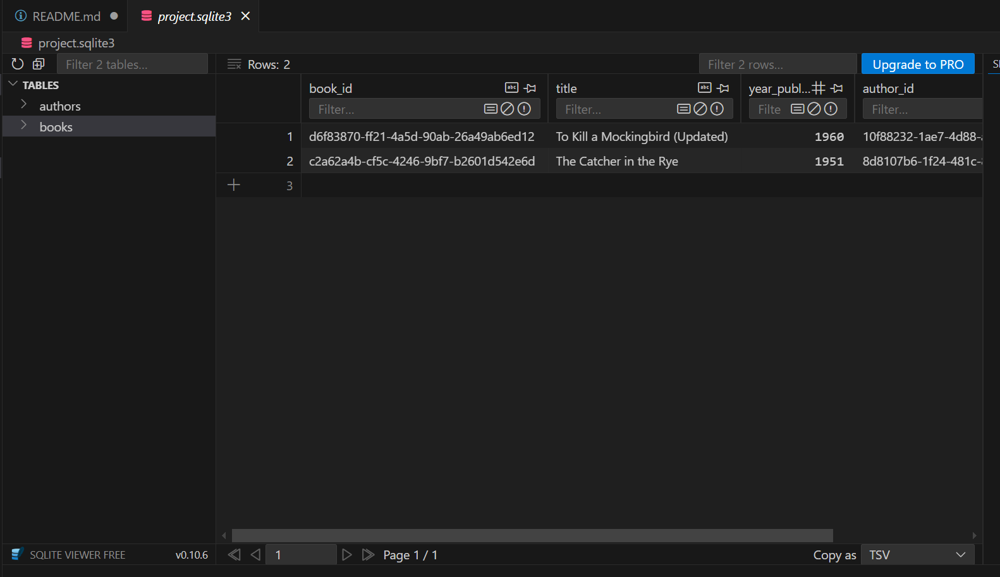
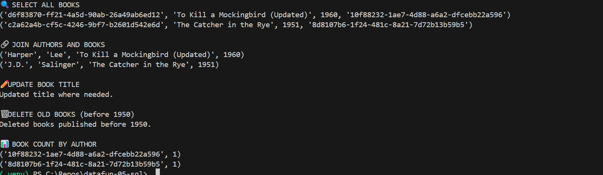

# 📚 SQL Bookstore Project

This project demonstrates how to create and interact with a simple SQLite database using Python and SQL. It features a mini bookstore system with two tables: `authors` and `books`. The project includes database creation, table setup, CSV import, and SQL queries with joins, updates, deletions, and aggregations.

---

## 🗂️ Project Structure

datafun-05-sql/
│
├── data/
│ └── authors.csv, books.csv
├── images/
│ └── authorssql.png, bookssql.png, Joinqueryresults.png
├── scripts/
│ └── (optional SQL or helper files)
├── sql/
│ └── create_tables.sql
├── project.sqlite3
├── create_db.py
├── query_all.py
├── query_join.py
├── README.md
└── requirements.txt

sql
Copy
Edit

---

## ⚙️ Setup Instructions

1. Clone this repo and navigate into it.
2. Create and activate a virtual environment:
    ```bash
    python -m venv .venv
    .venv\Scripts\activate     # Windows
    ```
3. Install dependencies:
    ```bash
    pip install -r requirements.txt
    ```
4. Create and populate the database:
    ```bash
    python create_db.py
    ```
5. Run queries:
    ```bash
    python query_all.py
    ```

---

## 🧠 SQL Queries Included

```sql
-- Select all books
SELECT * FROM books;

-- Join authors and books
SELECT authors.first, authors.last, books.title
FROM authors
INNER JOIN books ON authors.author_id = books.author_id;

-- Update a book title
UPDATE books
SET title = 'To Kill a Mockingbird (Updated)'
WHERE title = 'To Kill a Mockingbird';

-- Delete old books
DELETE FROM books
WHERE year_published < 1950;

-- Group books by author
SELECT author_id, COUNT(*) AS book_count
FROM books
GROUP BY author_id;

images/authorssql.png



